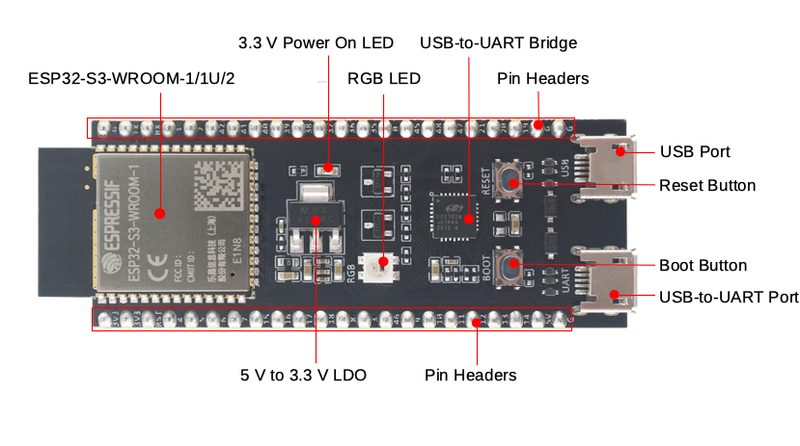
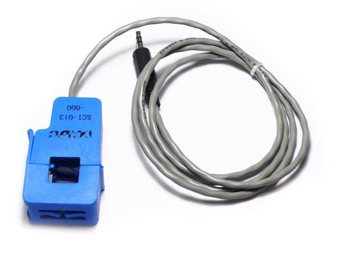
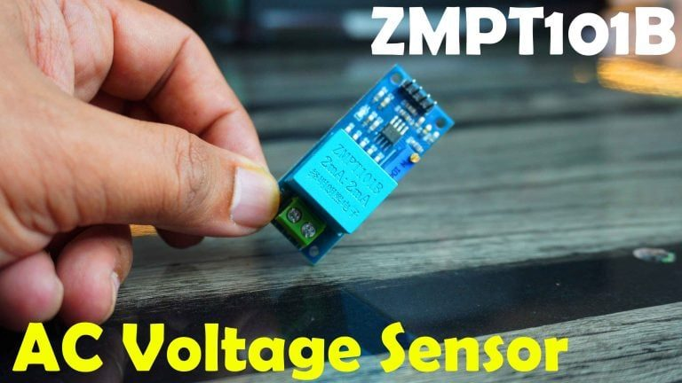
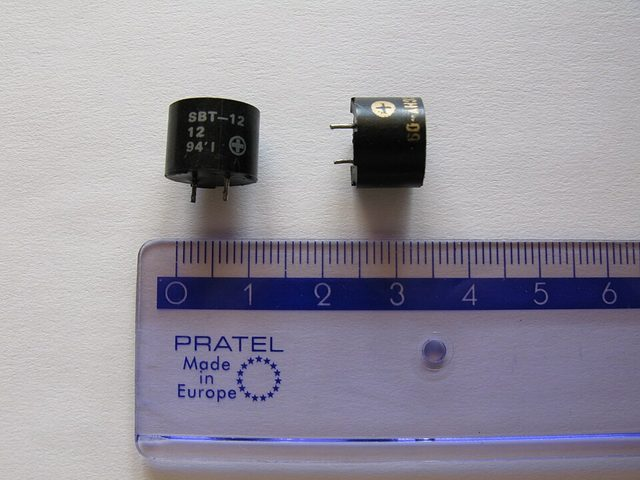
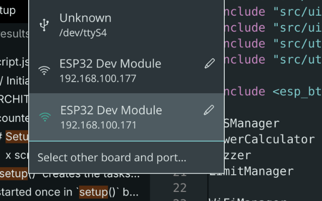

# ESP32 5-Channel AC Electricity Counter

A standalone box that watches 5 AC circuits — current, voltage, power, power
factor, monthly kWh per channel — on a live dashboard served by the board
itself. No cloud account, no internet needed: the ESP32 is the WiFi network
and the web server. Each channel has a monthly limit; on trip the buzzer
rings and the dashboard flags it. Counters survive power loss in flash.

Join `ESP32-Elec-Counter` (password `configure123`), open
`http://192.168.4.1/`, done. With home WiFi set, the board joins it and the
fallback AP stays off; an opt-in Firebase mirror pushes readings to
`/devices/<MAC>/latest` every second.

## Hardware

| Part | Pins |
|---|---|
| ESP32-S3 DevKit (or classic ESP32) | USB + GPIOs below |
| 5× CT sensors (SCT-013-100) | GPIO 7, 5, 6, 8, 4 |
| Voltage sensor (ZMPT101B) | GPIO 1 |
| Active buzzer (5 V) | GPIO 13 |
| Status LED (plain / WS2812 RGB) | GPIO 48 |

Classic ESP32 uses an ADC1-only pin map; defaults live in `src/config.h`.

 
<br>DevKit (Espressif docs) · SCT-013 clamp — one per channel (OpenEnergyMonitor docs)

 
<br>ZMPT101B voltage module (electroniclinic.com) · 5 V active buzzer
([Jdx / Wikimedia Commons](https://commons.wikimedia.org/wiki/File:Electromagnetic_buzzer_01.jpg), CC BY-SA 3.0)

## Build & flash

`./scripts/build.sh` is the only supported entry point — it re-embeds the
dashboard and checks the AsyncTCP patches:

```bash
./scripts/build.sh --version X.Y.Z --output-dir /tmp/build          # ESP32-S3
./scripts/build.sh --classic --output-dir /tmp/build-classic        # ESP32 classic
```

Classic needs `esp32:esp32:esp32:PartitionScheme=min_spiffs` (the default
slot overflows at 103%). If the build complains about AsyncTCP, run
`scripts/patch_async_tcp.py`, then rebuild. Flash app-only, so counters,
PIN and credentials survive:

```bash
esptool --port /dev/ttyACM0 --chip esp32s3 --baud 460800 \
        write-flash 0x10000 /tmp/build/esp32-electricity-counter.ino.bin
```

Prebuilt `.bin` files ride each GitHub release.

### Updating the firmware

Local only: USB as above, or ArduinoOTA on the LAN (network port
`esp32-elec-counter`). The Firmware panel shows the running version.
For updates from the cloud, see Limits (the `cloud-ota` branch).

## Use

Two ways to get the board onto your WiFi — USB serial (fastest) or
phone + browser (no tools needed).

### Option 1 — USB serial CLI

1. Plug the board into USB and open a serial monitor at **115200 baud**.
2. Join your home WiFi (quotes when the name has spaces — the board
   reboots onto it):
   ```
   setwifi "Home Router" mypass123
   ```
   No PIN is needed on serial — physical access *is* the key.
   (`clearwifi` forgets the network again.)
3. The boot banner prints the dashboard address:
   ```
   Dashboard: http://192.168.100.177/
   ```
   Open it in a browser on the same WiFi. Anything you change there
   needs the admin PIN (default `1234`).

### Option 2 — phone + browser, no tools

1. On your phone or PC, join the board's own network
   **`ESP32-Elec-Counter`**, password **`configure123`**.
2. Open `http://192.168.4.1/`.
3. Settings → **Home Network (default)** → fill Network + Password →
   Save (admin PIN `1234`). The board reboots onto your home WiFi and
   its own network disappears.
4. Back on home WiFi, find the board's address. Easiest: the Arduino
   IDE port menu lists it as a network port:

   

   Open `http://<that-ip>/` in the browser. The serial banner shows the
   same address.

### Cloud web UI (the same dashboard, from anywhere)

The board pushes to `/devices/<MAC>/latest` every second — home WiFi
only, never on the fallback AP. To aim it at your own Firebase project:

1. Create a Firebase project with a Realtime Database.
2. Authentication → enable the **Email/Password** provider and create
   the board user.
3. Put your Gmail in `database.rules.json` (the `cmd` rule) and deploy
   it: `firebase deploy --only database`.
4. On the board: `setcloud <db-host> <email> <pass>` — over serial, or
   Settings → **Remote Monitoring (cloud)**. Host only, no `https://`,
   no path. (`clearcloud` stops the mirror.)
5. Point `cloud-viewer/cloud.js` at your project (`CL_FIREBASE_CONFIG`,
   `CL_ADMIN_EMAIL`) and deploy hosting. Sign in with the admin Gmail
   for full control; everyone else is read-only.

- Rename the network with `set_ap` / `reset_ap` (serial or Settings,
  form is `set_ap <name> <pass>`). Changing the fallback AP name and password
  reboots the board; the AP only appears when home WiFi fails. Defaults `ESP32-Elec-Counter` /
  `configure123`.
- Serial console (`help` for the list): `status`, `wifi`, `cal`, `inject`,
  `reboot`, …

## Limits

- Cloud firmware updates live on the `cloud-ota` branch: `main`
  updates over USB or LAN ArduinoOTA only.

## License

MIT — see [LICENSE](LICENSE).

Full version history: `gh release list`.
