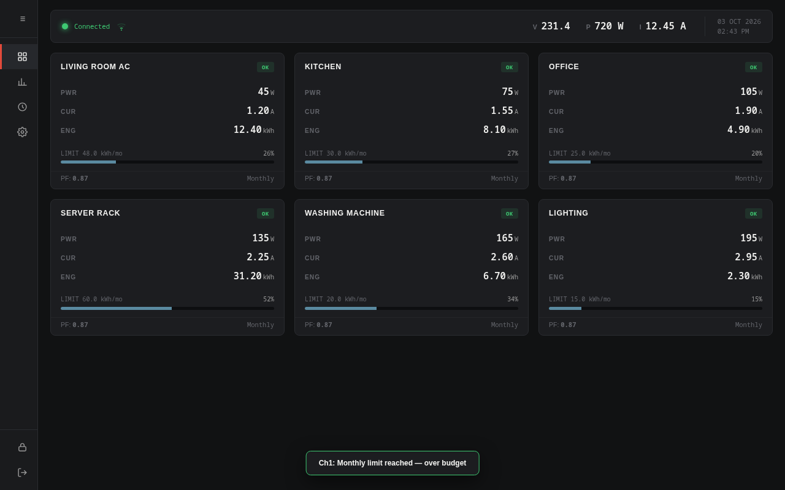
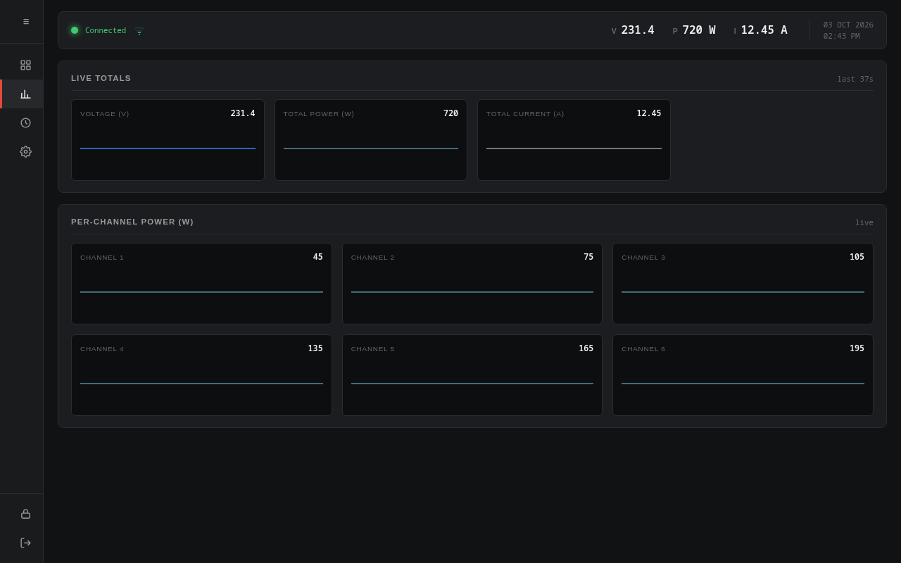
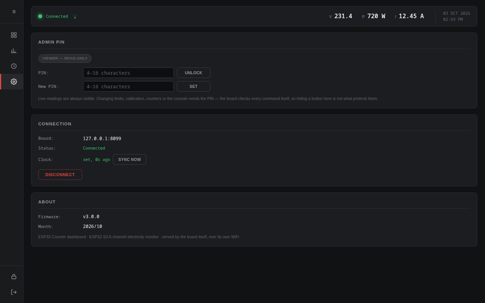

# ESP32-S3 6-Channel AC Electricity Counter



## 1. What is it?

A standalone box that watches 6 AC circuits at once — current, voltage, power,
power factor and monthly kWh per channel — and shows it all on a live web
dashboard served by the board itself. No cloud account, no router, no internet:
the ESP32 **is** the WiFi network and the web server.

Join `ESP32-Elec-Counter` (password `configure123`), open
`http://192.168.4.1/`, done.



## 2. Why?

- Know which circuit actually eats the power bill — per-channel W and kWh,
  not one meter for the whole house.
- Get warned before the bill gets big — each channel has a monthly limit; on
  trip the buzzer rings and the channel is flagged.
- Own your data — readings stay on your LAN, counters survive power loss in
  flash, browser works offline as an installed app.
- No monthly subscription, no phone-home telemetry, no app store.

## 3. How?

**Hardware**

| Component | Pins |
|---|---|
| CT current sensors ×6 (SCT-013-100) | GPIO 7, 5, 6, 8, 4, 2 |
| Voltage sensor (ZMPT101B) | GPIO 1 |
| Active buzzer | GPIO 13 |
| Status LED (plain / WS2812 RGB, CLI-selectable) | GPIO 48 |

**Firmware** — Arduino core for ESP32 (3.3.x), C++17, FreeRTOS with two cores:
a sensor task samples all ADC channels every 80 ms, computes true-RMS, power and
energy with an EMA low-pass per channel, and persists counters to NVS every 5 s;
a network task serves the dashboard and broadcasts snapshots over WebSocket at
~7 Hz. AsyncTCP is patched for lwIP core-locking; see `doc/opencode_agent/`.

**Dashboard** — a PWA written in plain HTML/CSS/JS (no framework, no build
step), embedded in flash as PROGMEM via `scripts/embed_web.py`. Same-origin
WebSocket means live updates with zero config, and the service worker makes it
installable on a phone.

**Security model** — viewing is open; anything that changes the board
(names, limits, calibration, counters, reboot, PIN) needs the admin PIN
(default `1234`, change it in Settings → Admin PIN). It is checked **on the
ESP32**, not in the browser.

Heads-up: the ESP32 network has no upstream internet, so phones show "no
internet" when joined — expected. Forgot the AP password? `reset_ap` over the
serial console restores the factory network.



## Build & flash

```bash
arduino-cli compile --fqbn esp32:esp32:esp32s3:FlashSize=4M,PartitionScheme=no_fs,CDCOnBoot=cdc .
scripts/patch_async_tcp.py --apply   # if AsyncTCP lacks the lwIP core-lock patches
esptool --port /dev/ttyACM0 --chip esp32s3 write-flash 0x10000 <sketch>.ino.bin
```

Rename/recover the network over serial: `set_ap <name> <pass>` / `reset_ap`.

### Changing the network name and password

From a browser: Settings → Access Point. Or over serial: `set_ap` /
`reset_ap`. Default is `ESP32-Elec-Counter` / `configure123`.

### Limits

No access from outside your own WiFi, no true PWA install on desktop, and the
board never sleeps.

Serial console (`help` for the list): `status`, `wifi`, `set_ap`, `led
normal|rgb`, `test led`, `cal`, `inject`, `reboot`, …

---

3.0.0 notes: AP-only architecture, NVS-persisted AP name/password, CLI LED
type switch, pinned-down AsyncTCP patches. Full history: `gh release list`.
